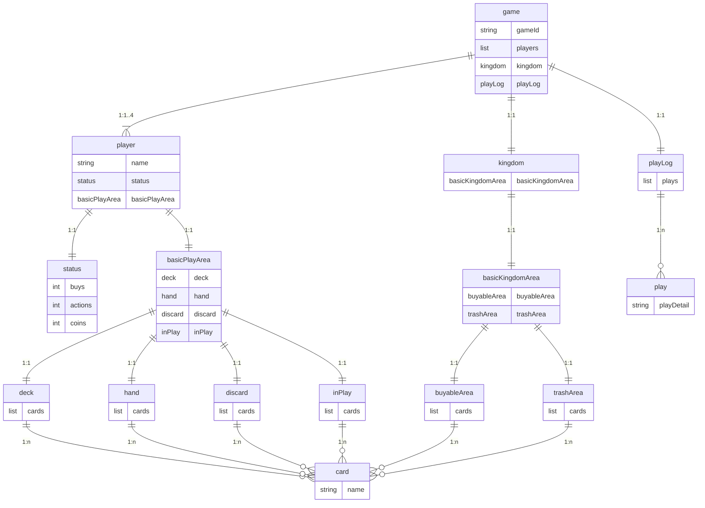

# 基本セットのドメインモデル

```mermaid

erDiagram
game ||--|{player: "1:1..4"
game ||--||kingdom: "1:1"
game ||--||playLog: "1:1"

player ||--||status: "1:1"
player ||--||basicPlayArea: "1:1"

playLog ||--o{play: "1:n"

basicPlayArea ||--||deck: "1:1"
basicPlayArea ||--||hand: "1:1"
basicPlayArea ||--||discard:"1:1"
basicPlayArea ||--||inPlay: "1:1"

kingdom ||--||basicKingdomArea: "1:1"

basicKingdomArea ||--||buyableArea: "1:1"
basicKingdomArea ||--||trashArea: "1:1"

buyableArea ||--o{card: "1:n"
trashArea ||--o{card: "1:n"

deck ||--o{card: "1:n"
hand ||--o{card: "1:n"
discard ||--o{card: "1:n"
inPlay ||--o{card: "1:n"

game {
  string gameId
  list players
  kingdom kingdom
  playLog playLog
}

player {
  string name
  status status
  basicPlayArea basicPlayArea
}

kingdom {
  basicKingdomArea basicKingdomArea
}

status {
 int buys
 int actions
 int coins
}

basicPlayArea {
  deck deck
  hand hand
  discard discard
  inPlay inPlay
}

playLog {
  list plays
}

play {
  string playDetail
}

basicKingdomArea {
  buyableArea buyableArea
  trashArea trashArea
}

buyableArea {
  list cards
}

trashArea {
  list cards
}

deck {
  list cards
}

hand {
  list cards
}

discard {
  list cards
}

inPlay {
  list cards
}

card {
  string name
}

```

