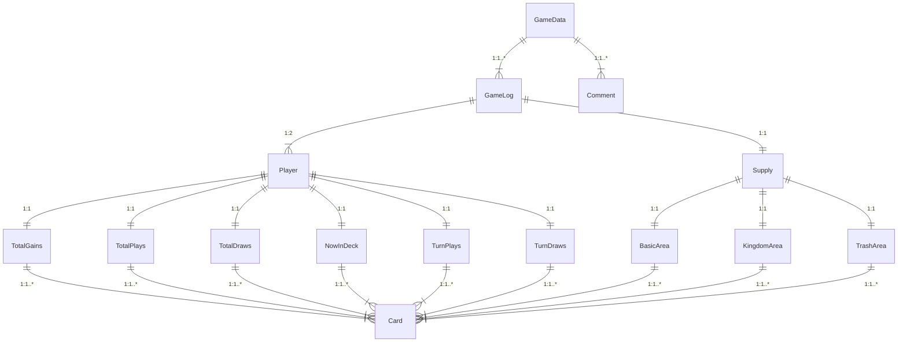

# 基本セットのドメインモデル

```mermaid

erDiagram
GameData ||--|{GameLog: "1:1..*"
GameData ||--|{Comment: "1:1..*"

GameLog ||--|{ Player: "1:2"
GameLog ||--|| Supply: "1:1"

Player ||--|| NowInDeck: "1:1"
Player ||--|| TurnPlays: "1:1"
Player ||--|| TurnDraws: "1:1"
Player ||--|| TotalGains: "1:1"
Player ||--|| TotalPlays: "1:1"
Player ||--|| TotalDraws: "1:1"

TotalGains ||--|{Card: "1:1..*"
TotalPlays ||--|{Card: "1:1..*"
TotalDraws ||--|{Card: "1:1..*"
NowInDeck ||--|{Card: "1:1..*"
TurnPlays ||--|{Card: "1:1..*"
TurnDraws ||--|{Card: "1:1..*"

Supply ||--|| BasicArea: "1:1"
Supply ||--|| KingdomArea: "1:1"
Supply ||--|| TrashArea: "1:1"

BasicArea ||--|{Card: "1:1..*"
KingdomArea ||--|{Card: "1:1..*"
TrashArea ||--|{Card: "1:1..*"

```

