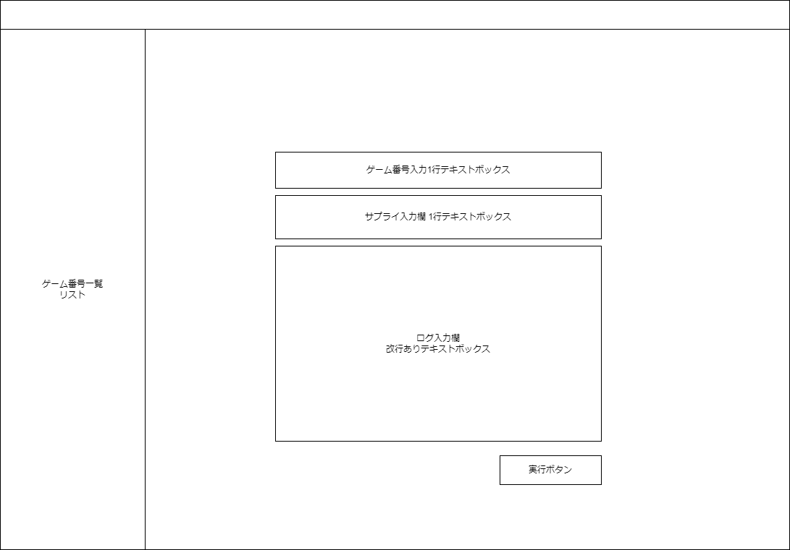

# 画面仕様書

## ゲーム番号・ログ入力画面

### 概要

この画面は、ゲーム番号とログを入力するための画面です。

### レイアウト

以下の要素を含むレイアウトを持ちます。

- ゲーム番号一覧リスト
- ゲーム番号入力欄
- ログ入力欄
- 送信ボタン

### 機能

- ゲーム番号一覧リスト：サイドバーとして画面共通的に表示される欄です。
- ゲーム番号入力欄：ユーザーはここにゲーム番号を入力します。
- サプライ入力欄：ユーザーはここにサプライをカンマ区切りで入力します
- ログ入力欄: ユーザーはここにログを入力します。
- 送信ボタン: 入力されたゲーム番号とログを送信します。

### バリデーション

| 項目名           | 必須 | 型     | 桁数 | 最小値    | 最大値    | 備考               |
| ---------------- | ---- | ------ | ---- | --------- | --------- | ------------------ |
| ゲーム番号入力欄 | 〇   | 文字列 | 9    | 000000000 | 999999999 |                    |
| サプライ入力欄   | 〇   | 文字列 | -    | -         | -         | 英語入力をサポート |
| ログ入力欄       | 〇   | 文字列 | -    | -         | -         | 英語入力をサポート |

データ入力例

| 項目名           | 入力例                       |
| ---------------- | ---------------------------- |
| ゲーム番号入力欄 | 123456789                    |
| サプライ入力欄   | サプライ入力サンプル.md 参照 |
| ログ入力欄       | ゲームログサンプル 参照      |

### 画面遷移

- 送信ボタンをクリックすると、入力されたゲーム番号とサプライ入力とログが処理され、次の画面に遷移します。
  - 入力内容をサーバへPOSTしてデータ登録する
  - 次の画面へ遷移する
