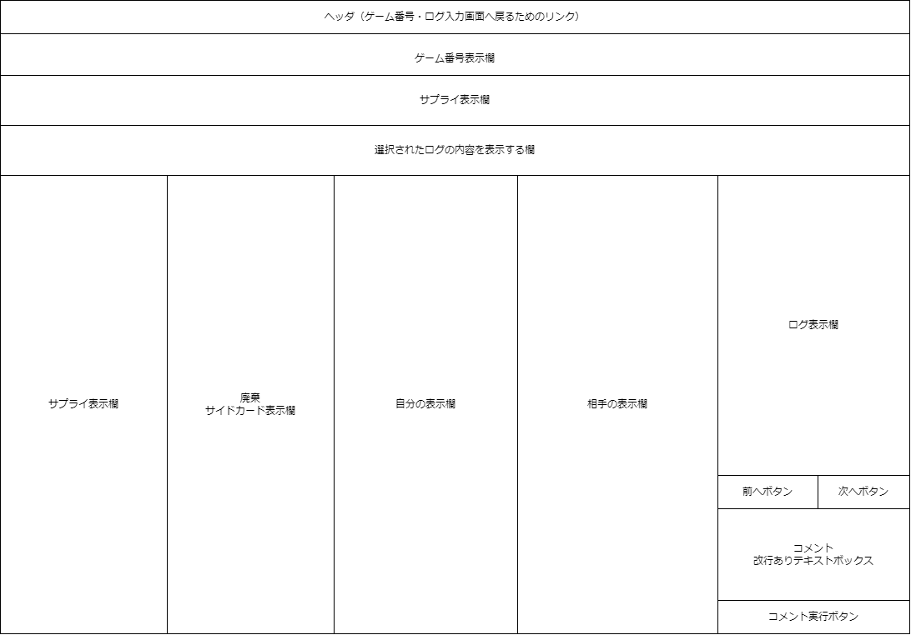

# 画面仕様書

## ゲーム番号・ログ入力画面

### 概要

この画面は、選択されたゲームを解析する画面です。

### レイアウト

### 機能

* ログの分析・表示機能
* コメント機能

### バリデーション

| 項目名         | 必須 | 型     | 桁数 | 最小値 | 最大値 | 備考 |
| -------------- | ---- | ------ | ---- | ------ | ------ | ---- |
| コメント入力欄 | ✕   | 文字列 | -    | -      | -      |      |

データ入力例

| 項目名         | 入力例                                                               |
| -------------- | -------------------------------------------------------------------- |
| コメント入力欄 | この場面ではGearを買い増すよりも勝利点行動に行った方が良いと思います |

### 画面遷移

- 画面上部のリンクを押下することでゲーム番号・ログ入力画面へ遷移する
